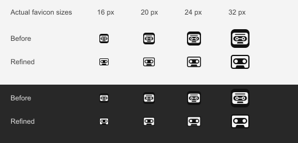

# Favicon legibility — website 4.0.2

Checked September 5, 2026 after feedback that the first cassette favicon was difficult to identify at small sizes.

## Design comparison

The previous icon nested a cassette inside a rounded square and used concentric reel details. At 16 pixels, the small reel holes were only 1.25 pixels across. The refined mark uses a 16-unit drawing grid, removes the surrounding tile and extra rings, and gives the two reel openings a 3-pixel diameter. The cassette outline and bottom tape-head notch retain the identifying shape.

Three simplified candidates were compared with the previous icon. The selected design keeps an enclosed tape window with two clear openings. The detailed 180-pixel Apple touch icon remains appropriate for its larger display size.

The comparison sheet rasterizes each SVG at the indicated native pixel size. View it at its natural size to judge the small icons; magnification is useful only for inspecting individual pixels.

## Checks

- Inspected 16, 20, 24 and 32-pixel images against light and dark tab backgrounds.
- Loaded the SVGs in Chrome in tab-like rows at an actual 16 CSS pixels, plus the four size samples. Checked image load completion and bounding rectangles.
- Inspected Chrome rendering at device pixel ratios 1, 1.25, 1.5 and 2. Raw screenshots at the latter three densities preserved physical pixel dimensions. These were browser emulations, not separate physical monitors or a user recognition study.
- Confirmed that the larger reel openings remain separated and the cassette outline and bottom notch remain visible in these comparisons.
- Generated explicit 16 and 32-pixel PNGs and an ICO containing native 16, 20, 24, 32, 40, 48 and 64-pixel images. Parsed every ICO directory entry and decoded each embedded image to verify its dimensions and bytes.
- Production TypeScript/Vite build passed. The generated application JavaScript and CSS filenames remain identical to website 4.0.1; this change is limited to icon assets, icon links, version metadata and documentation.

The small-size design selection is a visual judgment supported by these rendering checks. It is not a quantified recognition score.
